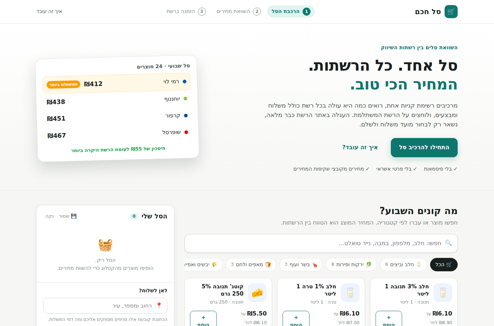
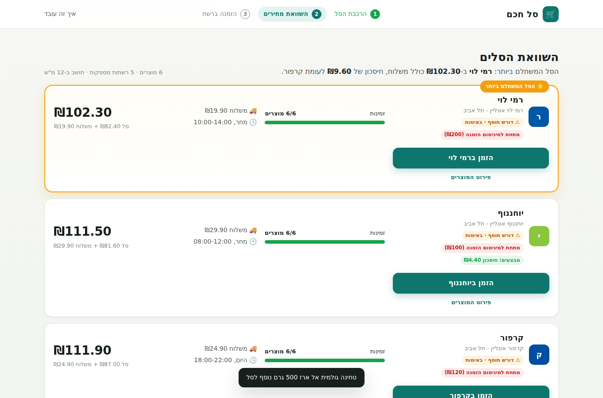

# Cart Transfer & Redirect MVP - "סל חכם"

מערכת להרכבת סל קניות אחיד, השוואת מחירים בזמן אמת בין רשתות השיווק (שופרסל, רמי לוי, קרפור, יוחננוף)
והעברה בלחיצה אחת לאתר הרשת המשתלמת - כשהעגלה שם כבר מלאה, ונותר רק לבחור חלון אספקה ולשלם.

המסמך המלא של האיפיון נמצא ב-[`docs/SPEC.md`](docs/SPEC.md); הארכיטקטורה ב-[`docs/ARCHITECTURE.md`](docs/ARCHITECTURE.md);
מנגנון ההעברה (Handoff) והרחבתו לרשתות נוספות ב-[`docs/HANDOFF.md`](docs/HANDOFF.md).





## הרצה

דרישות: Node.js 20 ומעלה. אין תלויות חיצוניות (`npm install` לא נדרש).

```bash
npm start            # http://localhost:3000
npm test             # 56 בדיקות (יחידה + אינטגרציה מקצה לקצה מול חנות ההדגמה)
npm run seed         # יצירה מחדש של קטלוגי הרשתות המדומים (data/catalogs/*.json)
npm run build:extension   # מעתיק את ה-injector לתוך תיקיית התוסף
```

מסכים:

| כתובת | מה יש שם |
|---|---|
| `/` | אפליקציית הלקוח: חיפוש, סל, כתובת, טבלת השוואה, כפתורי "הזמן ברשת X" |
| `/demo-store/` | "רשת שיווק" מדומה עם עגלת אורח, CSRF ו-checkout - להדגמת ההזרקה ללא תלות ברשת אמיתית |
| `/bookmarklet` | דף עם ה-Bookmarklet לגרירה לשורת הסימניות |
| `/api/health` | בריאות השרת |

### זרימת הדגמה מלאה (מקומית)

1. פתח `http://localhost:3000`, חפש מוצרים והוסף לסל (למשל חלב, מלפפון, במבה ×3).
2. הזן כתובת ("הרצל 12, תל אביב") ולחץ **השווה סלים**. הטבלה מציגה לכל רשת: סניף מספק, עלות, זמינות/חוסרים, משלוח וזמן אספקה, וסימון "הסל המשתלם ביותר".
3. לחץ **הזמן ב-Demo Market**. נפתח טאב חדש של חנות ההדגמה עם `#cart_id=...`; הסקריפט המוזרק
   (בדמו הוא נטען בדף, במציאות ע"י התוסף) מוסיף את הפריטים לעגלה, מציג "העגלה נטענה בהצלחה,
   כעת בחר מועד משלוח ובצע תשלום" ומעביר ל-checkout. באפליקציה הסטטוס מתעדכן ל"הושלם".

## פריסה (Deploy)

**סביבה חיה (Vercel):** https://cart-transfer-redirect.vercel.app - חנות ההדגמה ב-`/demo-store/`.

הריפו מוכן לפריסה בלחיצה אחת. הענף `claude/cart-transfer-redirect-mvp-wyxm2l` הוא ענף ברירת המחדל של הריפו.

[](https://vercel.com/new/clone?repository-url=https%3A%2F%2Fgithub.com%2Fnaorlugasi%2FCart&project-name=cart-transfer-redirect&repository-name=cart-transfer-redirect&env=HANDOFF_SECRET&envDescription=Secret%20used%20to%20sign%20handoff%20tokens)
[](https://railway.com/new/github?repo=naorlugasi/Cart)

* **Vercel** (serverless): `vercel.json` מנתב כל בקשה ל-`api/index.js`. הגדר את משתנה הסביבה `HANDOFF_SECRET`.
* **Railway** (שרת קבוע): `railway.json` מריץ `npm start`; `PORT` מסופק אוטומטית. מומלץ להגדיר `HANDOFF_SECRET`.

פרטים מלאים, כולל מה נשמר איפה בכל סביבה, ב-[`docs/DEPLOY.md`](docs/DEPLOY.md).

## מבנה הפרויקט

```
src/
  catalog/priceXml.js      פרסר לקובצי שקיפות מחירים (PriceFull / PromoFull XML)
  catalog/matching.js      נרמול עברית, Fuzzy Matching למוצרים שקילים, חיפוש בקטלוג
  catalog/mapping.js       מנוע מיפוי: override ידני -> GTIN -> fuzzy; מזהה storeItemId לכל רשת
  pricing/promotions.js    שקלול מבצעי כמות ("3 ב-10"), אחוזי הנחה, מחירי מבצע
  pricing/compare.js       טבלת ההשוואה: סניף לפי כתובת, סכומים, חוסרים, תחליפים, משלוח, "המשתלם ביותר"
  geo/branches.js          זיהוי עיר מכתובת חופשית ובחירת סניף מספק
  cart/cart.js             סלים, רשימות קבועות, מוצרים תחליפיים
  handoff/adapters/*.js    תיאור (כ-JSON) של API העגלה של כל רשת
  handoff/injector.cjs     הסקריפט שרץ באתר הרשת ומבצע את ההזרקה (משותף לתוסף / bookmarklet / WebView)
  handoff/handoffService.js יצירת handoff (cart_id), payload לתוסף, קליטת תוצאות
  handoff/alerts.js        מנגנון התרעה על שינוי מבנה API / שיעור כשלונות + probe יזום
server/                    שרת HTTP ללא תלויות: API, קבצים סטטיים, חנות הדגמה, persistence
public/                    אפליקציית הלקוח (Vanilla JS, RTL)
extension/                 תוסף Chrome (MV3)
bookmarklet/, mobile/      חלופות להזרקה: bookmarklet ו-In-App WebView
data/                      קטלוג מוצרים, רשתות וסניפים, קטלוגי רשתות, דוגמאות XML, overrides
scripts/                   seed, ייבוא קובצי מחירים, בניית התוסף, probe לרשתות
test/                      node:test
```

## API עיקרי

| Method | Path | תיאור |
|---|---|---|
| GET | `/api/products?q=&category=` | חיפוש מוצרים (substring + fuzzy) |
| GET | `/api/categories`, `/api/chains` | קטגוריות; רשתות וסניפים |
| POST | `/api/carts` | סל חדש |
| PUT | `/api/carts/:id/lines` | `{ productId, qty, substituteProductId? }` (qty 0 מסיר) |
| PUT | `/api/carts/:id/address` | `{ address: "הרצל 12, תל אביב" }` |
| GET | `/api/carts/:id/compare` | טבלת ההשוואה |
| GET/POST | `/api/lists`, `/api/lists/:id/load` | רשימות קבועות |
| POST | `/api/handoffs` | `{ cartId, chainId }` → `{ url: "https://.../#cart_id=…" }` |
| GET | `/api/handoffs/:id` | ה-payload לתוסף: פריטים + adapter + reportUrl |
| POST | `/api/handoffs/:id/results` | דיווח תוצאות ההזרקה מהדפדפן |
| GET | `/api/handoffs/:id/status`, `/api/handoffs/:id/script` | סטטוס; סקריפט מלא ל-WebView |
| GET | `/api/alerts`, POST `/api/alerts/probe` | התראות עמידות; בדיקה יזומה של ה-endpoints |
| GET | `/api/mapping/stats` | כיסוי המיפוי לכל רשת |

## ייבוא קובצי שקיפות מחירים

```bash
node scripts/import-prices.js --chain shufersal --price PriceFull7290027600007-001.xml \
     --promo PromoFull7290027600007-001.xml --store-item-id "P_{code}"
```

הפקודה ממירה את הקובץ ל-`data/catalogs/shufersal.json` (מחירים, מוצרים שקילים, מבצעים כחוקי תמחור).
כשמזהה הפריט באתר האונליין שונה מהברקוד, מעבירים טבלת תרגום עם `--id-map map.json`.
מיפויים ידניים שגוברים על GTIN/fuzzy נשמרים ב-`data/mapping-overrides.json`.

## מצב ה-adapters של הרשתות

13 רשתות מאומתות מול האתרים החיים (8.9.2026) ומסומנות `verified: true`:

| רשת | מנגנון | זיהוי פריט |
|---|---|---|
| שופרסל | Hybris, `POST /online/he/cart/add` (JSON + CSRFToken) | קוד אתר `P_<code>` (לרוב `P_<ברקוד>`) |
| רמי לוי | עגלת אורח ב-localStorage + תמחור ב-`/api/v2/cart` | ברקוד → id דרך `/api/catalog` |
| קרפור | Self Point, `carts` + PATCH `lines` | ברקוד → `retailerProductId` דרך `/products` |
| יוחננוף | Magento GraphQL `AddProductsToCart` | ברקוד (= SKU) |
| ויקטורי, טיב טעם, יינות ביתן, מחסני השוק, קשת טעמים, קוויק, שוק העיר, אקספרס מהדרין | Self Point (כמו קרפור), `src/handoff/adapters/selfPoint.js` | ברקוד → `retailerProductId` |
| חצי חינם | `/proxy/api/item/addItemToCart` | ברקוד → `Id` דרך `getItemsBySearch` |

הטעינה באתר הרשת נעשית עם סימניית "טען עגלה" (`/bookmarklet`) - בלי תוסף ובלי התקנה. ההקלטות ב-`recon/`, ההוכחות מקצה לקצה ב-`recon/e2e-<chain>.json`, הפרטים והמגבלות ב-`docs/HANDOFF.md`,
ומה שעדיין פתוח (מוצרים שקילים, משתמש מחובר ברמי לוי, סניפים, קטלוגים אמיתיים) ב-`docs/TODO.md`.
בייבוא קובצי מחירים: `--store-item-id "{code}"` (ברקוד) לרמי לוי, קרפור ויוחננוף; `"P_{code}"` לשופרסל.

## אבטחה ופרטיות

* אין שמירה של פרטי אשראי או סיסמאות - ההזרקה משתמשת בעוגיות שכבר קיימות בדפדפן של המשתמש.
* ה-injector מסרב לרוץ אם הדף הנוכחי אינו הדומיין של הרשת שאליה נוצר ה-handoff.
* ה-handoff מכיל רק מק"טים וכמויות, פג תוקף אחרי 6 שעות, ומזוהה במזהה אקראי קצר.
